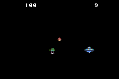

# hot-pursuit
A project to explore classes in C++ by implementing an Enemy class (alien) that chases the Player class (ufo) and adds a powerUp class (mushroom) for brief invincibility, and handles intersection logic throughout resetting the game if the player gets caught by an enemy. See instructions [here](./instructions.md)

hello world.

